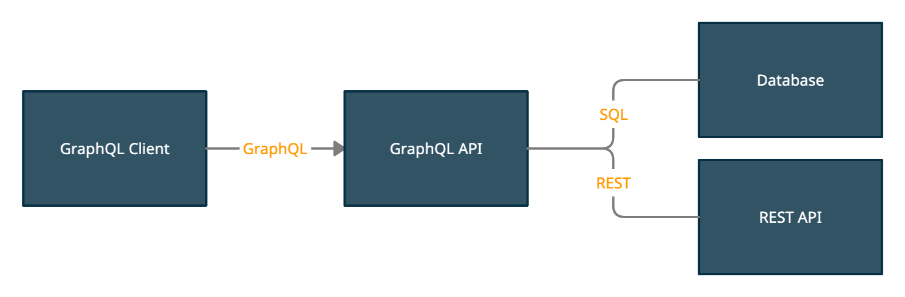
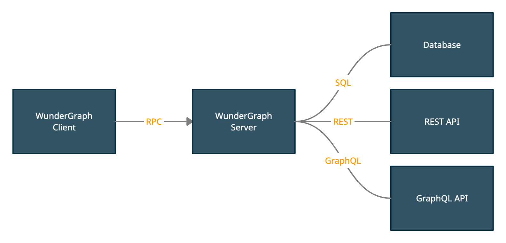

# Полное руководство по безопасности GraphQL: Устранение 13 наиболее распространенных уязвимостей GraphQL, чтобы сделать ваш API готовым к производству

Это 2024 год, и GraphQL на подъеме, чтобы стать [важным игроком в экосистеме API](https://trends.google.com/trends/explore?date=2014-01-01%202024-04-04&q=%2Fg%2F11cn3w0w9t,%2Fm%2F010ppjcy). Это идеальное время, чтобы поговорить о том, как сделать ваши GraphQL API безопасными и готовыми к производству.

Итак, вот мой тезис: GraphQL по своей природе небезопасен. Я докажу это в течение всей статьи и предложу решения. Одно из решений потребует некоторого радикального изменения в том, как мы думаем о GraphQL, но это принесет много преимуществ, которые выходят далеко за рамки просто безопасности.

> Если вы выберете случайный фреймворк GraphQL и запустите его с настройками по умолчанию в производстве, катастрофа не заставит себя ждать.

## 13 наиболее распространенных уязвимостей GraphQL

### 1. Разбор операции GraphQL против разбора URL

Почему? Почему GraphQL гораздо более уязвим, чем, например, REST? Давайте сравним URL с операцией GraphQL. Согласно Википедии, концепция URL была впервые опубликована в 1994 году, это 30 лет назад. Если мы ищем в том же источнике дату рождения GraphQL, мы видим, что это сентябрь 2014 года, примерно 10 лет назад.

Это дает разбору URL преимущество в 20 лет перед разбором операций GraphQL. Весьма заметное преимущество!

Далее, давайте посмотрим на грамматику antlr для обоих.

[Грамматика для разбора URL](https://github.com/antlr/grammars-v4/blob/master/url/url.g4) составляет 86 строк. [Грамматика для разбора документа GraphQL](https://github.com/antlr/grammars-v4/blob/master/graphql/GraphQL.g4) составляет 325 строк.

Так что можно справедливо сказать, что язык GraphQL примерно в 4 раза сложнее, чем тот, который определяет URL. Если мы учтем обе переменные, очевидно, что в разборе URL должно быть гораздо больше опыта и компетенции, чем в разборе операций GraphQL.

Но почему это вообще проблема? Недавно мой друг [проанализировал некоторые популярные библиотеки](https://github.com/StarpTech/graphql-parser-bench), чтобы увидеть, насколько быстро они разбирают запросы GraphQL. Меня порадовало видеть, что моя собственная библиотека [работала довольно хорошо](https://github.com/jensneuse/graphql-go-tools). В то же время меня удивило, что некоторые библиотеки не принимали тестовые операции, в то время как другие могли их разобрать.

Что это значит для нас? Человек, который проводил тесты, выбрал несколько библиотек GraphQL и провел несколько тестов. Этого было достаточно, чтобы найти некоторые ошибки. Что, если мы выберем все библиотеки и фреймворки GraphQL и протестируем их против многочисленных операций GraphQL?

Помните, что мы все еще говорим только о простом разборе операций. Что, если мы добавим построение действительного AST в уравнение? Что, если мы добавим выполнение операций? Мы почти забыли о проверке операций, это отдельная тема.

Несколько лет назад небольшая группа людей начала удивительный проект с открытым исходным кодом: CATS ([The GraphQL Compatibility Acceptance Test](https://github.com/graphql-cats/graphql-cats)). Это довольно сложно, но идея блестяща. Идея заключалась в том, чтобы создать инструмент, чтобы различные реализации GraphQL могли доказать, что они работают, как предполагалось. К сожалению, последний коммит проекта датирован 2018 годом.

Хорошо, разбор URL кажется простым и хорошо понятным. Разбор операций GraphQL - это кошмар. Вы не должны доверять любой библиотеке GraphQL без тщательного тестирования, включая фаззинг.

Мы все люди. Создание библиотеки GraphQL сложно. Я владелец реализации, [написанной на Go](https://github.com/jensneuse/graphql-go-tools). Это не просто, это много кода. Много кода означает много потенциальных ошибок.

И не поймите меня неправильно, речь идет не о ручном написании парсеров против генерируемых парсеров из грамматики. Превращение строки в AST - это всего лишь одна маленькая часть головоломки. Есть множество возможностей для ошибок.

### 2. Нормализация запросов GraphQL может потенциально привести к утечке полей

Вам не нужно нормализовать URL. Если вы можете разобрать его на вашем выбранном языке, он действителен, в противном случае - нет.

С GraphQL история другая. Вот пример:

```graphql
{
    foo
    foo: foo
    ... {
        foo
        ... {
            foo
        }
    }
    ... @include(if: true){
        foo
    }
    ...@skip(if: false){
        foo
    }
}
```

Много foo! Давайте нормализуем запрос.

```graphql
{foo}
```

Это гораздо меньше foo, отлично! Я мог бы усложнить это большим количеством фрагментов, вложенностью и т.д... В чем смысл?

Как мы можем доказать, что все библиотеки и фреймворки корректно нормализуют запрос? Что произойдет, если здесь что-то пойдет не так? Это может дать злоумышленнику возможность запросить поля, которые он/она не имеет права использовать. Возможно, есть скрытое поле, и, обернув его странным комбо inline fragment @skip, мы сможем его запросить.

Пока мы не сможем доказать, что это невозможно, я считаю, что это возможно, докажите мне обратное!

Вывод: Нет нормализации для URL. Больше кошмаров для GraphQL.

### 3. Валидация операций GraphQL, абсолютное минное поле

Я сам реализовал валидацию операций GraphQL. Один из файлов модульного теста [содержит более 1000 строк кода](https://github.com/jensneuse/graphql-go-tools/blob/master/pkg/astvalidation/astvalidation_test.go). Что я сделал, так это скопировал полную структуру из [спецификации GraphQL](https://spec.graphql.org/June2018/) по одной и превратил ее в модульные тесты. Есть различные способы, как это могло бы пойти не так. Ошибки копирования и вставки, общее непонимание, реализация логики для прохождения тестов, в то время как логика все еще неверна. Есть много подводных камней, на которые вы могли бы наступить.

Другие библиотеки и фреймворки, вероятно, принимают разные подходы. Вы также можете скопировать тесты из [референсной реализации](https://github.com/graphql/graphql-js), но это также не гарантирует, что логика на 100% правильная.

Опять же, поскольку у нас больше нет проекта, как CATS, мы действительно не можем доказать, что наши реализации верны. Я надеюсь, что все делают все возможное, чтобы сделать все правильно.

До тех пор, не доверяйте любой библиотеке валидации GraphQL, если вы сами ее не тестировали. Используйте много операций для тестирования.

Вывод: Если стандартная библиотека может разобрать ваш URL, он действителен. Если ваша выбранная библиотека проверяет операцию GraphQL, вы все равно должны быть осторожны, особенно когда имеете дело с PII (лично идентифицируемой информацией).

На этом этапе мы, вероятно, уже прошли через несколько ошибок, передав наш запрос через парсер, нормализацию и валидацию. Настоящая проблема все еще впереди, выполнение операции.

При выполнении операции GraphQL ответственность за правильное выполнение лежит не только на фреймворке. На этом этапе также есть большой шанс для пользователя фреймворка ошибиться. Это связано с тем, как разработан GraphQL. Операция GraphQL может перемещаться от узла к узлу, где бы она ни хотела, если вы ничего с этим не делаете. Так что диапазон возможных атак варьируется от простых атак отказа в обслуживании до более сложных подходов, которые возвращают данные, которые не должны быть возвращены. По этой причине мы дадим этому разделу немного больше структуры.

### 4. Атаки отказа в обслуживании на GraphQL

Если вы хотите ограничить скорость пользователя REST API, все, что вам нужно сделать, это сохранить их IP в истории в памяти, например, Redis, и ограничить их скорость вашим выбранным алгоритмом, например, сложным ограничением скорости окна. Каждый запрос считается одним запросом, это звучит глупо, но имеет значение в контексте GraphQL.

С другой стороны, с GraphQL вы не можете применить тот же шаблон. Одной единственной операции достаточно, чтобы остановить сервер GraphQL.

Вот несколько примеров того, как построить атаку отказа в обслуживании с GraphQL:

Перемещение туда-сюда, бесконечно.

```graphql
{
    foo {
        bar {
            foo {
                bar {
                    # повторять вечно
                }
            }
        }
    }
}
```

Просто спросите много foo:

```graphql
{
    a: foo
    b: foo
    c: foo
    # ...
    aa: foo
    # ...
    zzzzzzzzzzzz: foo
}
```

Как насчет эксплуатации проблем N+1?

```graphql
{
    arrayField { # возвращает 100 узлов
        moreArray { # возвращает 100 узлов
            moar { # возвращает 100 узлов
                storyGoesOn # возвращает 100 узлов ...
            }
        }
    }
}
```

Каждый слой вложенности запрашивает больше вложенных данных, отсюда экспоненциальный рост сложности выполнения.

Есть несколько вещей, которые вы должны учесть:

Обычно операции GraphQL представлены в виде JSON через HTTP POST запрос. Этот JSON может выглядеть так:

```json
{
  "query": "query Foo($bar: String!) {foo(bar:$bar){bar}}",
  "operationName": "Foo",
  "variables": {
    "bar": "baz"
  }
}
```

Первое, что вы должны сделать, - это ограничить количество байт JSON, которые вы принимаете. Какой может быть ваша самая большая операция? Несколько килобайт? Мегабайты?

Затем, при разборе операции, сколько узлов слишком много узлов? Вы принимаете любое количество узлов в запросе? Если у вас работает аналитика на вашей системе, возможно, возьмите самый большой запрос, добавьте запас сверху и установите там лимит?

Говоря о максимальном количестве узлов при разборе операции. Выбранный вами фреймворк действительно ли позволяет вам ограничить количество узлов, которые он прочитает?
Далее, давайте поговорим о вариантах, которые у вас есть, когда операция разобрана.

Вы можете рассчитать "сложность" операции. Вы можете "пройти" по AST и применить некий алгоритм для определения сложности операции. Один из способов определения сложности - например, вложенность.

Вот запрос с вложенностью 1:

```graphql
{foo}
```

Этот запрос имеет вложенность 2:

```graphql
{foo{bar}}
```

Этот алгоритм - хорошее начало. Однако у него есть некоторые недостатки. Вложенность сама по себе не является хорошим показателем сложности.

Чтобы лучше понять сложность, вам придется посмотреть на возможное количество узлов, которое может вернуть поле. Это похоже на `EXPLAIN ANALYZE` в SQL. Он дает вам некоторые оценки того, что планировщик запросов думает, как будет выполняться запрос. Имейте в виду, что эти оценки могут быть совершенно неверными.

Так что оценка не плоха, но вы также должны посмотреть на реальное количество возвращаемых узлов во время выполнения.

Компании с публичными GraphQL API, например, GitHub, реализовали довольно сложные алгоритмы ограничения скорости. Они учитывают [количество узлов, возвращаемых каждым полем](https://docs.github.com/en/graphql/overview/resource-limitations), и дают вам некоторые ограничения на основе своих расчетов.

Вот пример запроса из их объяснения:

```graphql
query {
  viewer {
    repositories(first: 50) {
      edges {
        repository:node {
          name
          issues(first: 10) {
            totalCount
            edges {
              node {
                title
                bodyHTML
              }
            }
          }
        }
      }
    }
  }
}
```

Есть одна важная вещь, которую мы можем узнать от них в отношении дизайна схемы GraphQL. Если у вас есть поле, которое возвращает список, убедитесь, что есть обязательный аргумент для ограничения количества возвращаемых элементов, например, `first`, `last`, `skip` и т.д... Только тогда можно рассчитать сложность перед выполнением операции.

Кроме того, вы также захотите подумать о пользовательском опыте вашего API. Это будет плохим пользовательским опытом, если операции GraphQL случайно не удаются, потому что из поля списка возвращается слишком много данных для некоторых экземпляров.

В конце статьи мы вернемся к этой теме и поговорим о еще лучшем подходе, подходе, который хорошо работает как для поставщика API, так и для потребителя.

### 5. Уязвимость SQL-инъекции в GraphQL

Это должно быть довольно известно, но это все равно должно быть частью списка.

Давайте посмотрим на простой резолвер, используя `graphql-js`:

```javascript
Query: {
  human(obj, args, context, info) {
    return context.db.loadHumanByID(args.id).then(
      userData => new Human(userData)
    )
  }
}
```

Запрос для этого резолвера может выглядеть так:

```graphql
query Human {
    human(id: "1"){
        id
        name
    }
}
```

В случае плохо написанной реализации `db.loadHumanByID`, SQL-запрос может выглядеть так:

```javascript
export const loadHumanByID = (id) => {
    const stmt = `SELECT * FROM humans where id = ${id};`;
    return db.query(stmt);
}
```

В случае "счастливого" пути, SQL-запрос будет отображаться так:

```sql
SELECT * FROM humans where id = 1;
```

Теперь давайте попробуем простую атаку:

```graphql
query Human {
    human(id: "1 OR 1=1"){
        id
        name
    }
}
```

В случае нашей атаки, SQL-запрос выглядит немного иначе:

```sql
SELECT * FROM humans where id = 1 OR 1=1;
```

Поскольку `1=1` всегда истинно, это вернет всех пользователей. Вы, возможно, заметили, что функция может вернуть только одного пользователя, а не список пользователей, но для иллюстрации я думаю, это понятно, что мы должны иметь дело с данной проблемой.

Что мы можем сделать с этим?

> Будьте либеральны в том, что вы принимаете, и консервативны в том, что вы отправляете. [Закон Постеля]

Решение проблемы не специфично для GraphQL. Вы всегда должны проверять входные данные. Для доступа к базе данных используйте подготовленные выражения или ORM, который абстрагирует слой базы данных, чтобы вы не могли внедрить произвольную логику в выражение по умолчанию.

В любом случае, не доверяйте пользовательским вводам. Недостаточно проверить, является ли это строкой.

### 6. Уязвимости аутентификации GraphQL

Еще один вектор атаки - неполная логика аутентификации. Могут быть разные пути запроса для перехода к одному и тому же объекту, вы должны убедиться, что каждый путь покрыт.

Вот пример схемы для иллюстрации проблемы:

```graphql
type Query {
    me: User!
}

type User {
    id: ID!
    name: String!
    friends: [User!]!
}
```

В резолвере для поля `me` вы извлекаете идентификатор пользователя из объекта контекста и разрешаете пользователя. До сих пор с этой схемой нет проблем.

Позже владелец продукта хочет новую функцию, поэтому новый член команды добавляет новое поле в тип Query:

```graphql
type Query {
    me: User!
    userByID(id: ID!):User
}

type User {
    id: ID!
    name: String!
    friends: [User!]!
}
```

С этим изменением вы должны убедиться, что поле `userByID` также защищено промежуточным программным обеспечением аутентификации. Это может звучать тривиально, но вы на 100% уверены, что ваш GraphQL не содержит ни одного незащищенного пути доступа?

Мы вернемся к этому пункту в конце статьи, потому что есть простой способ исправить проблему.

### 7. Уязвимость атаки обхода авторизации в GraphQL

Атаки обхода очень просты для эксплуатации, но их трудно обнаружить. Глядя на предыдущий пример, допустим, вы должны иметь право просматривать только `id` и `name` своих друзей;

Простой запрос для получения текущего пользователя выглядит так:

```graphql
{
    me {
        id
        name
        friends {
            id
            name
        }
    }
}
```

Поскольку мы сами вводим идентификатор пользователя в резолвер `me`, злоумышленник не может сделать много.

А как насчет этого запроса?

```graphql
{
    me {
        id
        name
        friends {
            id
            name
            friends {
                id
                name
            }
        }
    }
}
```

С этим запросом мы загружаем всех друзей и их друзей. Как мы можем предотвратить "обход" этого пути пользователем?

Вопрос в этом случае: защищаете ли вы рёбра (друзья) или узел (`User`)? На первый взгляд кажется, что защита ребра - это правильный путь.

Так что, каждый раз, когда мы входим в поле "друзья", мы проверяем, является ли родительский объект (`User`) текущим аутентифицированным пользователем. Это сработало бы для запроса выше, но у него есть несколько недостатков.

Один из которых - если вы защищаете только рёбра, вам придется защищать все. Вот еще один запрос, который не был бы защищен этим подходом, но это не единственная проблема.

```graphql
{
    userByID(id: "7") {
        id
        name
    }
}
```

Если вы не защитили поле `userByID`, мы могли бы просто угадать идентификаторы пользователей и собрать их данные. Переходя к следующему разделу, вы увидите, почему защита рёбер - это не очень хорошая идея.

### 8. Уязвимость глобальной идентификации объектов Relay

Ваш серверный фреймворк GraphQL может реализовывать спецификацию глобальной идентификации объектов Relay. Эта спецификация является расширением вашей схемы GraphQL, чтобы сделать ее совместимой с клиентом Relay, клиентом, разработанным и используемым Facebook.

В чем проблема с этой спецификацией? Давайте подробнее посмотрим, что она позволяет нам делать:

```graphql
{
    node(id: "4") {
        id
        ... on User {
            name
        }
}
```

Спецификация Relay определяет, что каждый узел в графе должен быть доступен через глобально уникальный идентификатор. Обычно этот ID является комбинацией `__typename` и полей `id` узла, закодированных в base64. С возвращенным узлом вы можете использовать фрагменты для запроса конкретных полей узла.

Это означает, что даже если ваш сервер полностью безопасен, включая расширение Relay, вы открываете еще один вектор атаки.

На этом этапе должно быть ясно, что защита рёбер - это игра в кошки-мышки, которая не в вашу пользу.

Лучшим решением проблемы является защита самого узла. Так что, каждый раз, когда мы входим в резолвер для типа User, мы должны проверить, разрешено ли текущему аутентифицированному пользователю запрашивать поля.

Как вы видите, вы должны принимать решения очень рано при проектировании вашей схемы GraphQL, а также схемы базы данных, чтобы иметь возможность надлежащим образом защищать узлы. Каждый раз, когда вы входите в узел, вы должны быть в состоянии ответить на вопрос, разрешено ли текущему зарегистрированному пользователю видеть поле или нет.

Таким образом, возникает вопрос, должна ли эта логика действительно находиться в резолвере. Если вы спросите создателей GraphQL, их ответ будет "нет". Поскольку они уже решили проблему на слое ниже резолверов, слое доступа к данным или их "Entity (Ent) Framework", они не затрагивали проблему с GraphQL. Это также причина, почему авторизация полностью отсутствует в GraphQL.

Сказав это, решение проблемы на слое ниже не является единственным допустимым решением. Если это сделано правильно, вполне нормально решать проблему из резолверов.

Прежде чем мы продолжим, вы должны взглянуть на отличный фреймворк [entgo](https://entgo.io/docs/privacy) и его архитектуру. Даже если вы не собираетесь использовать Golang для построения слоя вашего API, вы можете увидеть, сколько мысли и опыта вложено в дизайн фреймворка. Вместо того чтобы разбрасывать логику авторизации по вашим резолверам, вы можете определить политики на уровне данных, и нет никакого способа обойти их. Политика доступа является частью модели данных. Вам не обязательно использовать фреймворк, как entgo, но имейте в виду, что тогда вам придется решить эту сложную проблему самостоятельно.

Опять же, мы вернемся к этой уязвимости позже, чтобы найти гораздо более простое решение.

### 9. Уязвимость шлюза / проксирования GraphQL

Многие серверы GraphQL также являются API-шлюзами или прокси-серверами для других API. Внедрение аргументов GraphQL в подзапросы - это еще одна возможная угроза, с которой мы должны иметь дело.

Давайте вспомним схему выше:

```graphql
type Query {
    me: User!
    userByID(id: ID!):User
}

type User {
    id: ID!
    name: String!
    friends: [User!]!
}
```

Представим, что эта схема реализована с использованием REST API с GraphQL API в качестве API-шлюза спереди. Резолвер для поля `userByID` может выглядеть так:

```javascript
export const userByID = async (id: string) => {
    let results = await axios.get(`http://my.rest.api/user/${id}`);
    return results.data;
}
```

Теперь давайте не будем извлекать пользователя, а двух его друзей! Вот запрос (совершенно допустимый):

```graphql
{
    firstFriend: userByID(id: "7/friends/1"){
        id
        name
    }
    secondFriend: userByID(id: "7/friends/2"){
        id
        name
    }
}
```

Это приводит к следующим GET-запросам:

```http
GET http://my.rest.api/user/7/friends/1
GET http://my.rest.api/user/7/friends/2
```

Почему это возможно? Скаляр `ID` должен быть [сериализован в виде строки](https://spec.graphql.org/June2018/#sec-ID). В то время как "7" является допустимой строкой, "7/friends/1" тоже.

Чтобы решить проблему, вы должны проверить ввод. Поскольку система типов GraphQL проверяет только то, является ли ввод числом или строкой, вам нужно сделать еще один шаг вперед. Если вы принимаете строки в качестве ввода, например, потому что вы используете UUID или GUID, вы должны убедиться, что вы проверили их перед использованием.

Как мы можем это исправить?

Опять же, нам нужно проверить входные данные. WunderGraph предлагает вам простой способ [настроить валидацию JSON Schema](https://wundergraph.com/docs/overview/features/json_schema_validation) для всех входных данных. Это возможно, потому что WunderGraph сохраняет ваши операции полностью на сервере. Но мы вернемся к этому позже.

Все остальные должны убедиться, что проверяют любой ввод перед его использованием из ваших резолверов.

### 10. Уязвимость интроспекции GraphQL

Интроспекция GraphQL - это удивительная возможность GraphQL сообщать клиентам все о схеме GraphQL. Инструменты, такие как GraphiQL и GraphQL Playground, используют запрос интроспекции, чтобы затем предоставить пользователю функции автозавершения. Без интроспекции и схемы такие инструменты не существовали бы. В то же время у интроспекции есть и некоторые недостатки.

Схема GraphQL может содержать конфиденциальную информацию. Есть вероятность, что ваша схема GraphQL раскроет внутреннюю информацию или поля, которые используются только внутри. Возможно, одна из ваших команд работает над новым MVP, который еще не запущен. Ваши конкуренты могут сканировать ваш API GraphQL, используя запрос интроспекции. Каждый раз, когда происходит изменение в схеме, они могут немедленно увидеть это, используя diff.

Что мы можем сделать с этим? Большинство руководств советуют отключать запрос интроспекции в продакшене. То есть вы разрешите его во время разработки, но запретите запросы интроспекции при развертывании в продакшен.

Однако из-за дружелюбия некоторых реализаций фреймворка GraphQL, включая референсную реализацию `graphql-js`, [отключение интроспекции](https://blog.yeswehack.com/yeswerhackers/how-exploit-graphql-endpoint-bug-bounty/) не решает проблему. Имейте в виду, что каждая реализация, зависящая от референсной реализации `graphql-js`, также затрагивается этим.

Так что, если отключение интроспекции не помогает, что еще мы можем сделать с этим? Если ваш API используется только вашими внутренними сотрудниками, вы можете выполнить запросы интроспекции с помощью промежуточного программного обеспечения аутентификации. Таким образом, вы добавите слой аутентификации перед выполнением GraphQL. Очевидно, что это работает только для API, которые всегда требуют аутентификации, иначе пользователи не смогут сделать ни одного запроса.

Если вы создаете приложение, которое может использоваться пользователями без аутентификации, предложенное решение не работает.

В итоге, отключая интроспекцию во время выполнения, вы немного усложняете интроспекцию схемы, но с большинством фреймворков это все еще возможно.

Следующая уязвимость также будет использовать эту проблему. В конце будет представлено универсальное решение.

### 11. Уязвимость сгенерированных API GraphQL

Существует ряд сервисов и инструментов, таких как, например, [Postgraphile](https://www.graphile.org/postgraphile/) или [Hasura](https://hasura.io/), которые генерируют API из схемы базы данных. Обещание простое: укажите инструмент на базу данных, и вы получите полностью функциональный сервер GraphQL.

Как мы уже обсуждали ранее, не всегда легко и иногда невозможно полностью отключить интроспекцию во время выполнения.

Сгенерированные API GraphQL обычно следуют общей структуре для создания резолверов CRUD. Это означает, что нам довольно легко определить, имеем ли мы дело с API, созданным на заказ для конкретного варианта использования, или сгенерированным API. Почему это проблема?

Если мы не можем отключить интроспекцию, мы раскроем информацию о нашей полной схеме базы данных в публичный доступ. Это уже вызывает сомнения в подходе, если вы хотите иметь тесную связь между клиентом и сервером, что является случаем, если мы генерируем API из схемы базы данных. Сказав это, с точки зрения безопасности, это означает, что мы выставляем всю нашу  схему базы данных на публику.

Выставляя вашу схему базы данных на публику, вы предоставляете злоумышленникам много информации для поиска уязвимостей, попыток SQL-инъекций и т.д...

Я знаю, что это повторяющаяся схема, но мы также обсудим эту проблему в конце.

### 12. Уязвимость CSRF в GraphQL

Эта проблема не является прямой уязвимостью GraphQL, но общей угрозой для приложений, основанных на HTTP, с механизмами аутентификации на основе Cookie или сессий.

Если вы используете фреймворки, такие как NextJS, аутентификация на основе Cookie довольно распространена (и удобна), поэтому стоит об этом рассказать.

Представьте, что мы создаем приложение, которое позволяет пользователям отправлять деньги другим пользователям. Мутация для отправки денег может выглядеть так:

```graphql
mutation SendMoney {
    sendMoney(to: "123" amount: 10 currency: EURO){
        success
    }
}
```

Что может пойти не так?

Если мы создаем одностраничное приложение (SPA) на app.example.com с API на другом домене (api.example.com), первое, что вам нужно сделать, чтобы этот сценарий работал, - это настроить CORS. Убедитесь, что вы разрешили только ваш домен SPA и не используйте подстановочные знаки!

Следующая вещь, которая может пойти не так, - это правильная настройка свойств SameSite для домена API, который устанавливает Cookies. Вы захотите использовать SameSite lax или strict, в зависимости от пользовательского опыта. Для запросов может иметь смысл использовать lax, что означает, что мы можем использовать запросы из доверенного домена, например, другого поддомена. Для мутаций strict вариант определенно был бы лучшим вариантом, так как мы хотим принимать их только от источника. SameSite none позволит любому веб-сайту делать запросы к нашему домену API, независимо от их происхождения.

Если вы сочетаете плохую конфигурацию CORS с неправильными настройками Cookie SameSite, вы попадаете в беду.

Наконец, злоумышленники могут найти способ составить ссылку на наш сайт, которая приведет уже аутентифицированных пользователей к совершению транзакции, которую они на самом деле не хотят делать. Чтобы защититься от этой проблемы, вы должны добавить промежуточное программное обеспечение CSRF вокруг мутаций. WunderGraph [делает это из коробки](https://wundergraph.com/docs/overview/features/csrf_protection). Для каждой конечной точки мутации мы настраиваем промежуточное программное обеспечение CSRF. Кроме того, мы генерируем наши клиенты таким образом, чтобы они автоматически обрабатывали CSRF. Как разработчик, использующий WunderGraph, вам не нужно ничего делать.

### 13. Уязвимость избыточных ошибок GraphQL

Это еще одна распространенная проблема с API GraphQL. У GraphQL есть [хороший и выразительный способ возвращения ошибок](https://spec.graphql.org/June2018/#sec-Errors). Однако некоторые фреймворки по умолчанию просто немного слишком информативны.

Вот пример ответа от API, который автоматически генерируется на основе базы данных:

```json
{
  "errors": [
    {
      "extensions": {
        "path": "$.selectionSet.insert_user.args.objects",
        "code": "constraint-violation"
      },
      "message": "Uniqueness violation. duplicate key value violates unique constraint \"auser_authprovider_id_key\""
    }
  ]
}
```

Это сообщение об ошибке довольно выразительное, кажется, что оно исходит из SQL-базы данных и связано с нарушением ограничения уникального ключа.

Хотя это полезно для разработчика приложения, на самом деле это дает слишком много информации потребителю API.

Это сообщение можно было бы записать в журналы, если бы они были. Кажется, что пользователь приложения пытается создать контент с уже существующим идентификатором.

В правильно спроектированном API GraphQL это вообще не должно быть ошибкой. Лучший способ спроектировать этот API - вернуть объединение, которое охватывает все возможные случаи, например, успех, конфликт и т.д... Но это просто общая проблема сгенерированных API.

В любом случае, сгенерированный или нет, всегда должно быть промежуточное программное обеспечение на самом верху вашего HTTP-сервера, которое перехватывает подробные ошибки, такие как эта, и удаляет их из ответа. Если возможно, не используйте просто общий объект ответа "errors". Вместо этого используйте выразительную систему типов и определите типы для всех возможных результатов операции.

REST API имеют богатую систему HTTP-кодов состояния для указания результата операции. GraphQL позволяет вам использовать определения типов Interface и Union, чтобы потребители API могли легко обрабатывать ответы API. Очень трудно программно анализировать сообщение об ошибке. Это просто строка, которая может измениться в любое время.

Создавая типы Union и Interface для ответов, вы можете явно охватить все результаты операции. Затем потребитель API сможет переключаться по полю `__typename` и правильно обрабатывать "известную ошибку".

## Ваш список уязвимостей GraphQL включает в себя следующие пункты:

1. Уязвимости парсинга
2. Проблемы нормализации
3. Ошибки валидации операций
4. Атаки отказа в обслуживании
5. Уязвимости SQL-инъекций в GraphQL
6. Уязвимости аутентификации
7. Атаки обхода авторизации в GraphQL
8. Уязвимость глобальной идентификации объектов Relay
9. Уязвимость шлюза / проксирования GraphQL
10. Уязвимость интроспекции GraphQL
11. Уязвимость сгенерированных API GraphQL
12. Уязвимость CSRF в GraphQL
13. Уязвимость избыточных ошибок GraphQL

Это много проблем, которые нужно решить перед переходом в продакшен. Пожалуйста, не относитесь к этому легкомысленно. Если вы [посмотрите на HackerOne](https://hackerone.com/hacktivity?querystring=graphql), вы увидите, что проблема реальна.

Так что, мы хотим получить преимущества GraphQL, но пройти через весь этот список - это слишком много работы. Есть ли лучший способ использовать GraphQL? Есть ли способ использовать GraphQL по-другому, чтобы мы не сталкивались со всеми этими проблемами.

Ответ на этот вопрос - да! Все, что вам нужно сделать, - это скорректировать свое видение GraphQL.

## Решение 13 наиболее распространенных уязвимостей GraphQL для частных API

Большинство из нас используют GraphQL API внутри. Это означает, что разработчики, которые используют GraphQL API, находятся в той же организации, что и люди, которые предоставляют API. Кроме того, я предполагаю, что мы не меняем наши операции GraphQL во время выполнения.

Все это сводится к корневой причине проблемы.

> Разрешение клиентам API отправлять операции GraphQL по HTTP - это корень всех зол.

Все это можно полностью избежать, это не приносит никакой ценности и только создает вред. Вполне нормально разрешать разработчикам в защищенной среде отправлять произвольные операции GraphQL. Однако большинство приложений не меняют свои операции GraphQL в продакшене, так зачем вообще это разрешать?

Давайте посмотрим на архитектуру, которая вам наиболее знакома.



Клиент GraphQL общается с сервером GraphQL.

Теперь давайте внесем небольшое изменение в архитектуру, чтобы исправить все 13 проблем.



Вместо общения GraphQL между клиентом и сервером мы говорим на RPC, более конкретно на JSON-RPC. Затем сервер обрабатывает для нас аутентификацию, авторизацию, кэширование и т.д. и пересылает запросы на исходные серверы.

Мы не изобрели это. Это не что-то новое. Так делают компании, такие как Facebook, Medium, Twitter и другие.

То, что мы сделали, это не просто сделали это возможным и исправили проблемы, перечисленные выше. Мы создали удобный для использования опыт разработчика. Мы собрали все в одном месте. Вам не нужно устанавливать множество зависимостей.

Давайте немного разберем решение, чтобы вы могли полностью понять, как мы смогли решить все уязвимости.

### Решение уязвимостей, связанных с анализом, нормализацией и проверкой операций GraphQL

Самый безопасный код - это код, который вообще не нужно запускать. У каждого кода есть ошибки. Чтобы исправить ошибки, нам приходится писать больше кода, что означает, что мы вводим еще больше ошибок.

Итак, как мы можем заменить GraphQL на RPC по проводам?

Во время разработки разработчики определяют все операции, которые требуются для приложения. В то время, когда приложение готово к развертыванию, мы анализируем, нормализуем и проверяем все операции. Затем мы генерируем конечные точки JSON-RPC для каждой операции.

Как уже упоминалось, мы нормализовали операции. Это позволяет нам рассматривать все входные данные (переменные) как объект JSON. Затем мы можем проанализировать типы переменных и получить схему JSON для ввода. Кроме того, мы можем проанализировать схему ответа запроса GraphQL. Это дает нам вторую схему JSON. Эти две будут очень удобны позже.

Делая все это, что происходит автоматически, мы получаем две вещи:

1. Ряд конечных точек JSON-RPC
2. Определения схемы JSON для входных и выходных объектов всех конечных точек

Делая это во "время развертывания", нам не нужно делать это во время выполнения снова. Мы можем "предварительно скомпилировать" дерево выполнения. Все, что остается во время выполнения, - это ввести переменные и выполнить дерево.

Мы позаимствовали эту идею у систем баз данных SQL, она довольно похожа на "Подготовленные выражения".

Хорошо, это означает, что мы решили три проблемы.

К сожалению, мы также ввели новую проблему! Нет простых в использовании клиентов, которые могли бы использовать наш API JSON-RPC.

К счастью, мы извлекли две схемы JSON на конечную точку. Если мы подадим их на генератор кода, мы сможем генерировать полностью типобезопасные клиенты на любом языке.

Эти клиенты не только очень малы, но и очень эффективны, так как им не нужно делать много.

Итак, в итоге мы не только решили три проблемы, но и сделали наше приложение более производительным.

Как еще один побочный эффект, вы также можете [генерировать формы](https://github.com/rjsf-team/react-jsonschema-form) из этих определений схемы JSON. Это полностью интегрировано в WunderGraph.

### Решение атак отказа в обслуживании GraphQL

Большинство уязвимостей GraphQL DOS происходят от того, что злоумышленники могут легко создавать сложные вложенные запросы, которые запрашивают слишком много данных.

Как мы обсуждали выше, мы просто заменили GraphQL на RPC. Это означает, что нет динамических операций GraphQL. Для каждой операции мы можем настроить определенный лимит скорости или квоту. Затем мы можем легко ограничивать скорость наших пользователей, так же, как мы делали это с REST API.

### Решение SQL-инъекций в GraphQL

Мы извлекли схему JSON для каждой конечной точки RPC. Эту схему JSON можно настроить по вашему желанию, чтобы позволить вам проверять все входные данные. [Посмотрите нашу документацию](https://wundergraph.com/docs/reference/directives/json_schema_directive) и как вы можете использовать директиву `@jsonSchema` для настройки схемы JSON для каждой операции.

Вот пример того, как применить шаблон Regex для ввода сообщения:

```graphql
mutation (
    $message: String! @jsonSchema(
        pattern: "^[a-zA-Z 0-9]+$"
    )
){
    createPost(message: $message){
        id
        message
    }
}
```

### Решение уязвимостей аутентификации GraphQL

Проблема с аутентификацией заключалась в том, что вы должны убедиться, что каждый возможный путь запроса покрыт промежуточным программным обеспечением аутентификации.

Введение слоя RPC по умолчанию блокирует все возможные пути запроса. Кроме того, вы можете по умолчанию [заблокировать все операции](https://wundergraph.com/docs/reference/wundergraph_config_ts/configure_operations) за промежуточным программным обеспечением аутентификации. Если вы хотите открыть операцию для публики, вы должны сделать это явно.

### Решение уязвимостей атак обхода авторизации в GraphQL

С точки зрения злоумышленников, атаки обхода возможны только в том случае, если есть что-то, что они могут "обойти". Защищая слой GraphQL с помощью слоя RPC, эта функция удаляется из общедоступного API. Самой большой угрозой теперь является сам разработчик, так как он может случайно раскрыть слишком много данных.

### Решение уязвимости идентификации объектов Relay

Вспоминая проблему выше, проблема со спецификацией Relay возникает с двух сторон. Одна из них - неполная защита аутентификации, другая - защита ребер, когда защита узлов была бы правильным способом сделать это.

Спецификация Relay позволяла вам запрашивать любой узел с глобально уникальным идентификатором объекта. Это дает разработчикам (и клиенту Relay) мощный инструмент, но также создает еще одну проблему, которую нужно решить.

Вы, возможно, видите некоторую повторяемость здесь, но уязвимость Relay также покрывается фасадом RPC.

### Решение уязвимостей шлюза / проксирования GraphQL

Это одна из более сложных проблем для решения. Если мы используем пользовательские входные данные в качестве переменных для подзапросов, мы должны убедиться, что эти переменные точно соответствуют тому, что мы ожидаем, и не пытаются эксплуатировать нижележащую систему.

Чтобы помочь смягчить эти проблемы, мы сделали очень простым [определения схемы JSON для переменных](http://localhost:3002/docs/reference/directives/json_schema_directive). Таким образом, вы можете определить шаблон Regex или другие правила для проверки входных данных перед их внедрением в последующие запросы, запросы к базе данных и т.д...

Система типов GraphQL абсолютно замечательна и очень полезна, особенно для облегчения жизни потребителей API. Однако, когда дело доходит до интерпретации запроса GraphQL, все еще есть несколько пробелов, которые мы пытаемся исправить.

### Решение уязвимости интроспекции GraphQL

Как мы видели в описании проблемы, отключение интроспекции GraphQL может быть не таким простым, как кажется, в зависимости от используемого вами фреймворка.

Тем не менее, интроспекция полагается на слой GraphQL. Если вы посмотрите, как работает интроспекция, это просто еще один запрос GraphQL, даже если это особый запрос, с довольно большим количеством вложений.

Должен ли я повторяться снова и сказать вам, что, не выставляя GraphQL, вы больше не затрагиваетесь этой проблемой?

Помните, что мы все еще разрешаем интроспекцию во время разработки. Инструменты, такие как GraphiQL, будут продолжать работать, просто не в продакшене, или, по крайней мере, не с особым токеном аутентификации.

### Решение уязвимости сгенерированных API GraphQL

Если API GraphQL является точной копией схемы вашей базы данных, вы раскрываете внутренние элементы вашей архитектуры через интроспекцию GraphQL. Но мы уже решили эту проблему.

### Решение уязвимости CSRF в GraphQL

Способ смягчения этой проблемы заключается в правильной настройке CORS и настроек SameSite на вашем API. Затем добавьте промежуточное программное обеспечение CSRF к слою API. Это добавляет зашифрованные CSRF-куки для каждого пользователя. Как только пользователь войдет в систему, передайте им их токен csrf. Наконец, если пользователь хочет вызвать мутацию, они должны представить свой токен CSRF в специальном заголовке, который затем может быть проверен промежуточным программным обеспечением CSRF. Если что-то идет не так, или пользователь выходит из системы, удалите CSRF-куки, чтобы заблокировать все мутации, пока снова не будет действительной сессии пользователя.

Все это может звучать немного сложно, особенно взаимодействие между клиентом и сервером, отправка токенов CSRF и заголовков туда и обратно.

Вот почему мы добавили все это в WunderGraph по умолчанию. Все мутации автоматически защищены. На стороне сервера у нас есть все промежуточные программные обеспечения. Клиент генерируется автоматически, поэтому он точно знает, как обращаться с токенами CSRF и заголовками.

### Решение уязвимости избыточных ошибок GraphQL

Эта проблема, вероятно, одна из больших угроз, хотя ее легко исправить. После разрешения операции, прямо перед отправкой ответа клиенту, убедитесь, что вы удалили всю конфиденциальную информацию из объекта ошибок.

Это особенно важно, если вы проксируете к другим службам. Не просто передавайте все, что у вас есть от вверхнего потока. Если вы обращаетесь к REST API, и код ответа не 200, не возвращайте ответ как общий объект ошибки.

Кроме того, подумайте о вашем API как о продукте. Как должен выглядеть пользовательский опыт вашего "продукта" в случае ошибки? Помогите вашим пользователям понять ошибку и то, что они могут с ней сделать, по крайней мере, для "известных хороших ошибок". В случае "плохих ошибок", тех неожиданных, не будьте слишком конкретными для ваших пользователей, они могут быть не дружелюбными.

## Решение 13 наиболее распространенных уязвимостей GraphQL для публичных API

Хорошо, вы видели, что, изменив нашу архитектуру и развив наше понимание GraphQL, мы можем устранить почти все проблемы, которые исходят от самого GraphQL. Остается самая большая уязвимость всех систем - люди, которые их создают, мы, разработчики!

> Если процесс отладки означает, что мы устраняем ошибки, как мы должны назвать это, когда пишем код?

Хорошо, мы почти закончили. Мы пропустили одну небольшую группу API. Мы говорили о частных API почти весь этот материал, но мы сделали это по хорошей причине, вероятно, 99% API являются частными.

Но что насчет партнерских и публичных API? Что, если мы не хотим ставить слой RPC перед нашим API? Что, если мы хотим напрямую предоставить GraphQL нашим потребителям API?

Так делают компании типа Shopify и GitHub. Что мы можем узнать у них?

На данный момент [Shopify решил 1273 отчета](https://hackerone.com/shopify?type=team). Они выплатили в качестве вознаграждений 1.656.873 долларов хакерам в диапазоне от 500 до 50.000 долларов за вознаграждение.

Twitter решил всего [1364 проблемы](https://hackerone.com/twitter?type=team) на общую сумму 1.424.389 долларов.

Snapchat выплатил только 439.067 долларов с [389 решенными отчетами](https://hackerone.com/snapchat?type=team).

GitLab выплатил поразительные 1.743.639 долларов [с общим числом решенных проблем 845](https://hackerone.com/gitlab?type=team).

Эти вознаграждения не только связаны с GraphQL, но все перечисленные выше компании можно найти в списке сообщенных проблем GraphQL.

Всего на GraphQL есть [70 отчетов](https://hackerone.com/hacktivity?querystring=graphql&filter=type:all&order_direction=DESC&order_field=popular&followed_only=false&collaboration_only=false) с большим количеством выплаченных вознаграждений. Если вы ищете на других веб-сайтах с вознаграждениями за ошибки, вы, вероятно, найдете больше.

Компании, такие как GitHub, имеют людей, которые создают специализированную инфраструктуру, чтобы лучше понять, как используется их API GraphQL. Мне было приятно встретиться с удивительной Клэр Найт и послушать ее [доклад](https://www.youtube.com/watch?v=YNTRfzmaQmk&list=PLpi1lPB6opQyraZSmwFre_FpL00_3nTzV&index=50) на последнем саммите GraphQL, это было довольно давно...

Я представил вам все эти данные, чтобы сделать два вывода.

Во-первых, действительно ли вам нужно раскрывать ваш API GraphQL? Если нет, отлично! Вы можете применить все решения из этой статьи.

Если, при всех обстоятельствах, вы абсолютно хотите раскрыть API GraphQL, убедитесь, что у вас есть необходимая экспертиза для этого. У вас должны быть эксперты по безопасности внутри компании или вы должны их нанять, вы должны регулярно проводить аудиты и тестирование на проникновение. Не относитесь к этому легкомысленно!

## Давайте поговорим об API и безопасности!

У вас есть вопросы или вы хотите обсудить API, GraphQL и безопасность? [Встретимся в Discord](https://wundergraph.com/discord) 

Мы также с удовольствием ответим на звонок с вами и дадим вам демо. [Забронируйте сейчас бесплатную встречу!](https://wundergraph.com/demo) 

## Попробуйте сами!

Вы заинтересованы, как работает концепция GraphQL-to-RPC в реальности? Посмотрите нашу быструю [стартовую инструкцию за одну минуту](https://wundergraph.com/docs/guides/getting_started/quickstart?utm_source=security-guide) и попробуйте концепции, обсуждаемые в этой статье.